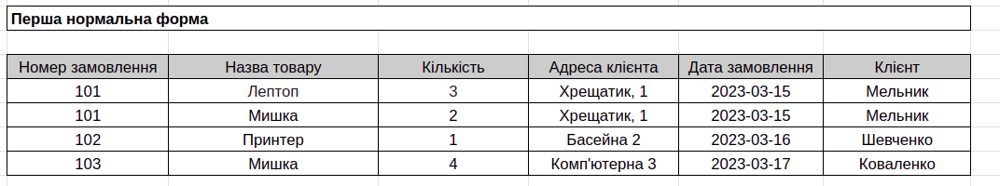
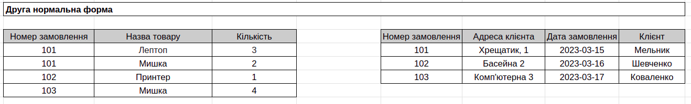
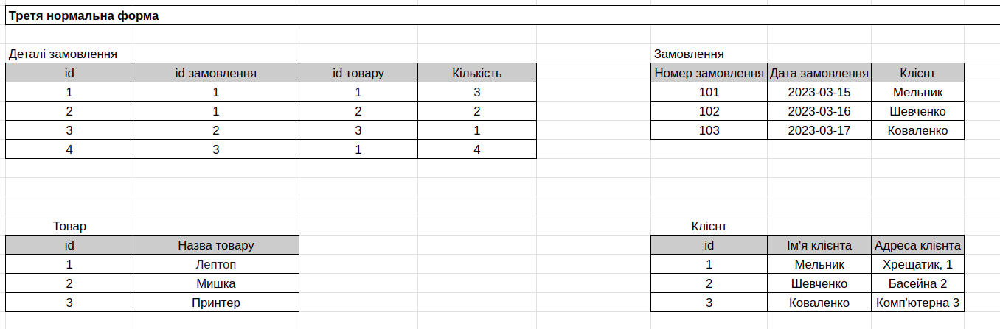
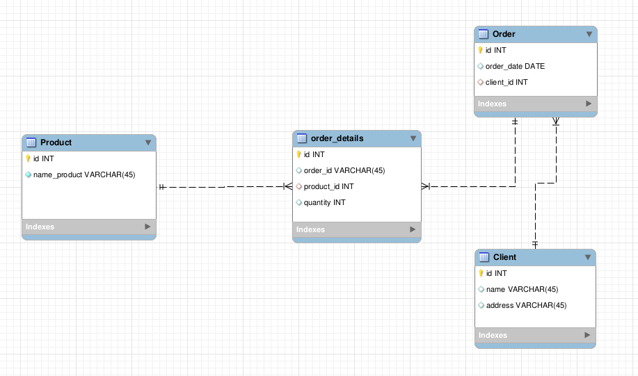
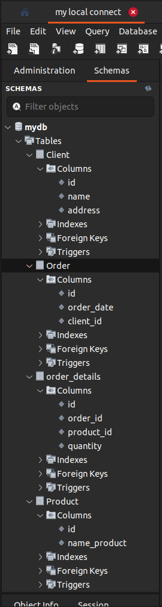

# Database Normalization and ER Diagram

This project involves the normalization of a database table through three normal forms, followed by the creation of an ER diagram for the resulting tables.

## Steps:

1. **1NF Conversion**: 

2. **2NF Conversion**: 

3. **1NF Conversion**: 

## ER-diagram:

## Final scheme:

